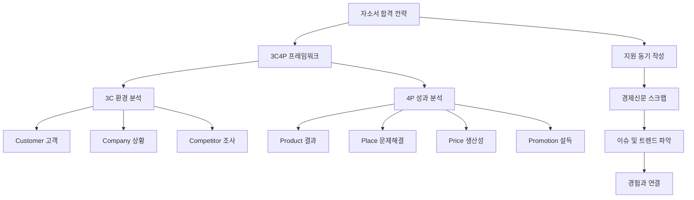

# 전략적 자소서 작성법: 3C4P로 나를 마케팅하라

목차

- 1. 학습 목표
- 2. 자소서의 핵심 원칙: 논리 구조와 3C4P
- 2.1. 자소서 작성의 4가지 원칙
- 2.2. 3C 분석: 환경과 상황 파악하기
- 2.3. 4P 분석: 성과와 행동 구체화하기
- 3. 지원 동기 작성 전략: 경제신문 스크랩 활용
- 3.1. 지원 동기의 핵심: 산업 안목 기르기
- 3.2. 경제신문 스크랩 3단계 프로세스
- 3.3. 지원 동기 구조화: How + Result

### 1. 학습 목표

- 3C4P 분석 프레임워크를 이해하고, 자기소개서(자소서) 작성에 활용하는 방법을 배웁니다.

- 경험을 논리적 구조로 분해하고, 수치화하여 구체적인 성과를 표현하는 방법을 익힙니다.

- 경제신문 스크랩을 통해 산업 및 기업 이슈를 파악하고, 이를 지원 동기에 연결하는 전략을 수립합니다.

### 2. 자소서의 핵심 원칙: 논리 구조와 3C4P

### 2.1. 자소서 작성의 4가지 원칙

좋은 자기소개서는 논리적 구조가 탄탄해야 합니다.

- 수식어 제거: 형용사나 수식어는 실제 내용을 가리므로 모두 없애야 합니다.

- 논리 구조: 경험을 퍼즐처럼 분해하여 논리적인 블록식으로 구성합니다.

- 3C4P 적용:3C4P로 설명되지 않는 내용은 과감하게 제거해야 합니다.

- 경험을 분해하는 과정은 재미있는 퍼즐 맞추기와 같습니다.

- '이 경험이 있으면 더 좋겠네' 하며 새로운 아이디어를 떠올릴 수 있습니다.

- 자소서의 완성도를 높이려면 논리 구조의 정확성이 가장 중요합니다.

### 2.2. 3C 분석: 환경과 상황 파악하기

3c는 Customer(고객), Company(상황), Competitor(조사 내용) 세 가지를 의미합니다.

- 이 세 가지 요소는 내가 어떤 환경에서 행동했는지 설명하는 Why(왜)에 해당합니다.

| 3C 요소 | 의미 | 예시 (나의 경험) |
| --- | --- | --- |
| Customer (고객) | 내가 만족시켜야 했던 대상 | 1차: 돈을 내는 사람, 2차: 협력 부서, 3차: 상사/동료 팀원 |
| Company (상황) | 당시 내가 처했던 상황과 목표 | 개인 카페 알바 시 '매출 목표'나 '개선 목표'를 설정해 보는 것 |
| Competitor (조사) | 문제 해결을 위해 조사한 내용 | 관련 논문, 옆 회사 분석, 새로운 기준이나 실험 방법 찾기 |

- 고객 (Customer): 고객은 돈을 내는 사람뿐 아니라, 함께 일했던 동료나 협력 부서도 포함됩니다.

- 예시: 내부 프로그램 오류를 발견했다면, 그 시스템을 쓸 회사 내부 직원이 고객입니다.

- 상황 (Company): 당시 목표가 없었더라도, '다시 돌아간다면 어떤 목표를 세울까' 생각하며 적어봅니다.

- 조사 (Competitor): 단순히 조사한 내용(뽀삐)이 아니라, 조사 내용을 통해 찾은 새로운 방식이나 기준을 적어야 합니다.

### 2.3. 4P 분석: 성과와 행동 구체화하기

4p는 Product(결과), Place(문제 해결), Price(생산성), Promotion(설득) 네 가지를 의미합니다.

- 4P는 내가 무엇을(What) 했고, 어떻게(How) 결과를 냈는지 설명하는 부분입니다.

- 결과 (Product): 내가 이룬 최종 결과물을 한 줄로 요약합니다.

- 예시: 당일 500장 판매, 1일 매출 300만 원 달성 등 수치화된 결과를 제시합니다.

- 문제 해결 (Place): 성과를 내는 데 있어 해결해야 했던 문제점을 찾습니다.

- 이 문제는 3C에서 찾은 고객의 니즈와 연결되어야 합니다.

- 생산성 (Price):비용을 낮추거나 시간을 아낀 것을 의미합니다.

- 예시: 3D 프린터 활용으로 부품 비용 절감, 공구 대여로 인건비 절감 등 대단하지 않아도 괜찮습니다.

- 설득 (Promotion): 내가 의사소통하거나 설득하려고 했던 행동을 설명합니다.

- 예시: 지출 결의서 작성 가이드라인 만들기, POP(광고물)를 손으로 써서 홍보하기 등입니다.

### 3. 지원 동기 작성 전략: 경제신문 스크랩 활용

### 3.1. 지원 동기의 핵심: 산업 안목 기르기

합격하는 지원 동기는 회사와 연결되는 주제를 뽑아 수치와 트렌드를 섞어 쓰는 것입니다.

- 지원 동기는 '내가 이 분야에 관심을 가지고 있다'는 것을 보여주는 것이 목적입니다.

- 면접관은 여러분에게 업계 전문가 수준의 평론을 요구하지 않습니다.

- 경제신문 스크랩은 산업에 대한 안목을 길러줍니다.

- 매일 아침 오전에 딱 한 달만 해보면 지원 동기가 어렵다는 말이 사라집니다.

- 스크랩을 통해 최근 이슈와 사회 현상을 쉽게 파악할 수 있습니다.

### 3.2. 경제신문 스크랩 3단계 프로세스

경제신문 스크랩은 단순히 기사를 읽는 것을 넘어, 정보를 분석하고 구조화하는 과정입니다.

| 단계 | 활동 내용 | 목적 |
| --- | --- | --- |
| 1단계: 훑어보기 | A면 전체를 쓱쓱 훑어봅니다. | 지원 산업이나 회사 이름이 있는 기사만 자세히 봅니다. |
| 2단계: 분석 및 표시 | 기사 한 개를 복사해 붙여 넣고 분석합니다. | 숫자는 빨간색, 트렌드는 파란색으로 표시합니다. |
| 3단계: 추가 조사 | 표시된 내용 중 추가 조사할 내용을 찾습니다. | 전문적인 단어나 경쟁사 정보를 찾아 정보력을 높입니다. |

- 숫자 활용: '30조 원 투입', '시장점유율 35.5%' 등 명확한 수치를 찾아냅니다.

- 트렌드 파악: '초격차 달성', '극자외선 공정 기반 D램' 등 첨단 기술이나 방향성을 파악합니다.

- 경쟁사 비교: 경쟁사(예: TSMC)의 투자 규모를 비교하여 산업의 문제점을 제기할 수 있습니다.

### 3.3. 지원 동기 구조화: How + Result

지원 동기는 '나의 경험(How) + 입사 포부(Result)' 구조로 작성합니다.

- 소제목: '나의 이런 경험으로 여기에 기여하고 싶습니다'와 같이 경험과 포부를 연결합니다.

- 본문 구성:

- 3C (60%): 경제신문 스크랩을 통해 얻은 기업 조사 내용을 대다수 채웁니다.

- 4P (40%): 내 필살기 리스트에 있는 경험 몇 개를 간단히 연결합니다.

- 마무리: '경쟁자와 가격 차이를 20% 이상 벌리는 데 기여하는 엔지니어가 되겠습니다'처럼 구체적인 입사 포부 한 줄로 끝냅니다.

- 지원 동기의 본질: '너네 기술력을 보니 대박 칠 것 같아. 내가 이런 경험이 있는데 너네 회사와 함께 성장하고 싶어'라는 솔직한 열정입니다.

- 평소 조사한 수치만 있다면, 글을 정리하는 것은 매우 쉽습니다.
