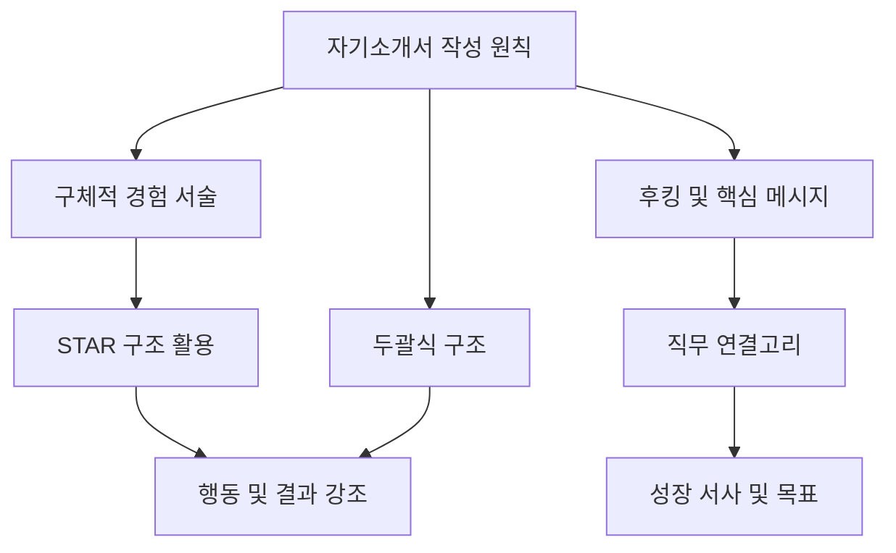
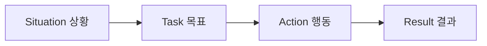

# 설득의 글쓰기: 면접관이 원하는 자기소개서 전략

목차

- 1. 학습 목표
- 2. 면접관을 사로잡는 자기소개서의 기본 원칙
- 2.1. 30초 안에 끝내는 '두괄식' 글쓰기
- 2.2. 첫 줄에 '후킹'과 '핵심 메시지' 담기
- 2.3. 문장의 기본기와 진정성 확보
- 3. 경험을 구체화하고 논리적으로 연결하기
- 3.1. 추상적인 표현 대신 '행동 + 결과' 제시
- 3.2. 실무 경험이 없어도 '업무 태도' 어필하기
- 3.3. 경험을 구조화하는 'S.T.A.R 구조'
- 4. 회사와 직무에 기여하는 성장 서사 완성하기
- 4.1. 전공, 직무, 회사 간의 논리적 연결고리
- 4.2. 구체적인 성장 서사와 목표 제시
- 4.3. 신입의 겸손함과 주도적인 실천력

### 1. 학습 목표

- 면접관의 시선을 사로잡는 자기소개서의 핵심 작성 원칙을 이해합니다.

- 경험을 구체적이고 설득력 있게 전달하는 구조화된 글쓰기 방법을 배웁니다.

- 신입 지원자로서 갖춰야 할 겸손함과 주도성의 균형을 파악합니다.

### 2. 면접관을 사로잡는 자기소개서의 기본 원칙

### 2.1. 30초 안에 끝내는 '두괄식' 글쓰기

면접관은 지원서를 30초 이상 보지 않습니다.

- 가장 중요한 것은 처음 한 문장입니다.

- 첫 문장에서 지원자가 어떤 사람인지 바로 느껴져야 합니다.

- 모든 문단은 결론부터 말하는두괄식으로 시작해야 합니다.

- 예시: "저는 성실합니다" 대신 행동과 결과를 제시해야 합니다.

- "프로젝트에서 무엇을 해서 어떤 효율을 높인 사람입니다"처럼 써야 합니다.

### 2.2. 첫 줄에 '후킹'과 '핵심 메시지' 담기

자기소개서의 첫 문장은 면접관의 흥미를 끌어야 합니다.

| 요소 | 설명 | 비유 |
| --- | --- | --- |
| 후킹 (Hooking) | 독자의 시선을 잡아끄는 매력적인 요소 | 낚시 바늘처럼 면접관의 관심을 낚는 것 |
| 핵심 메시지 | 내가 가진 가장 강력한 무기 | 영화 예고편처럼 가장 중요한 장면을 보여주는 것 |
| 목표 | "이 사람 흥미로운데?" 하고 다음 문장을 읽게 만드는 것 |  |

- 첫 줄은 후킹을 사용해 사람을 끌어당겨야 합니다.

- 내가 가진 무기가 궁금하게 만드는 것이 핵심 포인트입니다.

- 면접관이 단 한 줄로 '아, 이런 사람이구나' 하고 이해하게 만듭니다.

### 2.3. 문장의 기본기와 진정성 확보

맞춤법과 문장 구조는 지원자의 기본기를 보여줍니다.

- 띄어쓰기, 맞춤법, 문장 구조는 반드시 지켜야 할 기본입니다.

- 어휘나 표현이 어색하면 성의 없이 썼다는 인상을 줍니다.

- 솔직함이 느껴지는 글이 더 큰 설득력을 가집니다.

- 완벽한 서사보다는 부족했지만 개선한 경험이 좋습니다.

- 이런 경험담이 진정성을 높여 면접관을 설득합니다.

### 3. 경험을 구체화하고 논리적으로 연결하기

### 3.1. 추상적인 표현 대신 '행동 + 결과' 제시

"성실합니다" 같은 추상적인 말은 아무것도 증명하지 못합니다.

- 성실함, 책임감, 도전정신 같은 말은 사용하지 않습니다.

- 이런 말 대신 구체적인 행동과 결과로 보여줘야 합니다.

- 예시: "매일 1시간씩 추가 학습하여 프로젝트 오류율을 15% 줄였습니다."

- 경험은 구체적으로 서술해야 면접관이 이해하기 쉽습니다.

### 3.2. 실무 경험이 없어도 '업무 태도' 어필하기

실무 경험이 없다고 불안해할 필요는 없습니다.

| 경험 소재 | 어필할 수 있는 업무 태도 |
| --- | --- |
| 아르바이트 경험 | 책임감, 고객 응대 능력 |
| 학교/학원 프로젝트 | 문제 해결 능력, 전문 지식 적용 |
| 동아리/팀 활동 | 협업, 소통, 리더십 |
| 어려움을 극복한 개인 경험 | 회복 탄력성, 끈기 |

- 경험이 꼭 직무와 직접 관련될 필요는 없습니다.

- 아르바이트나 동아리 활동 등 다양한 소재로 업무 태도를 보여줄 수 있습니다.

- 핵심은 내가 어떻게 문제를 해결했는가를 드러내는 것입니다.

- 이것이 곧 지원자의 실무 태도의 증거가 됩니다.

### 3.3. 경험을 구조화하는 'S.T.A.R 구조'

어떤 경험이든 S.T.A.R 구조를 활용하면 논리적으로 풀 수 있습니다.

- S (Situation/Task): 어떤 상황이었고, 무슨 목표가 있었는지 설명합니다.

- A (Action): 목표를 위해 내가 구체적으로 한 행동을 서술합니다.

- R (Result): 그 행동으로 인해 어떤 결과가 나왔는지 명확히 제시합니다.

- 경험의 진짜 핵심은 "배운 점"을 강조하는 것입니다.

- 경험의 크기보다 문제 마주침, 행동, 배운 점이 중요합니다.

### 4. 회사와 직무에 기여하는 성장 서사 완성하기

### 4.1. 전공, 직무, 회사 간의 논리적 연결고리

지원 직무를 선택한 이유에 대한 납득이 필요합니다.

- 본인의 전공, 경험, 프로젝트가 지원 직무로 이어지는 흐름이 중요합니다.

- 이 흐름이 논리적으로 보여야 면접관을 설득할 수 있습니다.

- 회사의 가치나 프로젝트 방향과 나의 목표가 맞닿아 있는지 확인합니다.

### 4.2. 구체적인 성장 서사와 목표 제시

단순히 "성장하고 싶습니다"는 설득력이 없습니다.

| 항목 | 추상적인 표현 | 구체적인 표현 |
| --- | --- | --- |
| 성장 목표 | 열심히 배우고 싶습니다. | 어떤 부분에서 어떻게 성장할 것인지. |
| 회사 기여 | 회사에 도움이 되겠습니다. | 그 성장이 회사에 어떤 도움이 되는지. |

- 성장 서사는 구체적으로 작성해야 설득력이 생깁니다.

- 프로젝트 경험은 직무와의 연결점으로 확장하여 설명해야 합니다.

### 4.3. 신입의 겸손함과 주도적인 실천력

신입은 완벽함보다 빠르게 배우는 사람이라는 인상을 줘야 합니다.

- "부족한 부분은 빠르게 학습하고 개선합니다"라는 메시지가 좋습니다.

- 이 문장은 겸손하면서도 주도적인 인상을 동시에 줍니다.

- '많이 배우고 싶습니다'처럼 받기만 하는 태도로 보여선 안 됩니다.

- 핵심은 '배우고 적용하는 사람'이라는 메시지입니다.
